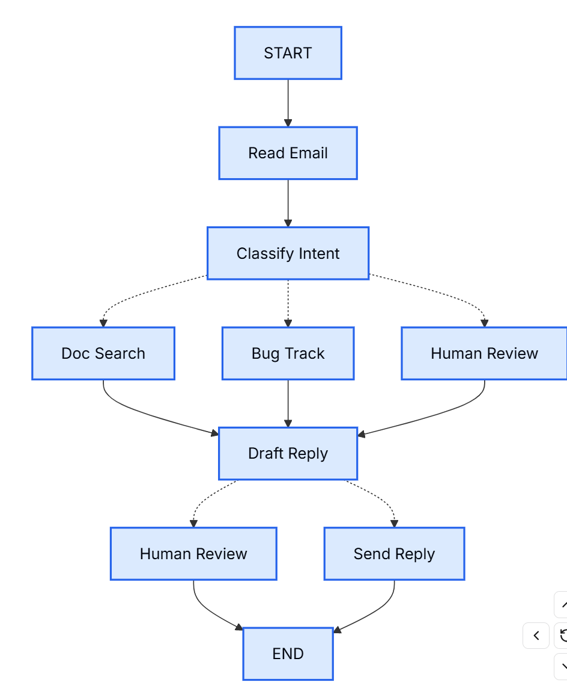

# Thinking in Langgraph

## 1. Step 1: 将你的工作流程分解成一个个独立的步骤。
首先，确定流程中的各个步骤。每个步骤都将成为一个节点 （一个执行特定操作的函数）。然后，绘制这些步骤之间的连接图。

> 虚线表示可能选择路径
## 2. Step 2:明确每个步骤需要做什么
对于图中的每个节点，确定它代表什么类型的操作以及它需要什么上下文才能正常工作。
- LLM steps 当某个步骤需要理解、分析、生成文本或做出推理决策时
- Data steps 当某个步骤需要从外部来源检索信息时
- Action steps 当某个步骤需要执行外部操作时
- User input steps 当某个步骤需要人工干预时
## 3. Step 3：设计state
**state** 是智能体中所有节点均可访问的共享内存 。您可以将其想象成智能体用来记录其在处理过程中学习和决策的笔记本。
- What belongs in state?
  - include in state 它是否需要跨步骤保持？如果需要，则将其置于某种状态中。
  > 例如:之后无法恢复,多个后续/下游节点需要,重新获取成本高昂,需要保留到审查阶段,用于调试和恢复
  - Don't store 能否从其他数据中推导出它？如果可以，则在需要时计算，而不是将其存储在状态中。
* 一个关键原则：状态应该存储原始数据，而不是格式化的文本。需要时，在节点内部添加格式化提示。

这种分离意味着：
- 不同的节点可以根据自身需求对相同的数据进行不同的格式化。
- 无需修改​​状态架构即可更改提示模板。
- 调试更清晰——可以清楚地看到每个节点接收到了哪些数据。
- 代理可以在不破坏现有状态的情况下进化
## 4. Step 4: 构建节点
将每个步骤实现为一个函数。LangGraph 中的一个节点就是一个 Python 函数，节点接收状态、执行操作并返回更新。
## 5. Step 5: 将它们连接起来
将节点连接成一个可运行的图。

## 妥善处理错误
### 1.瞬态错误（网络问题、速率限制）
添加重试策略，以自动重试网络问题和速率限制问题：
``` python
from langgraph.types import RetryPolicy

# initial_interval重试间隔时间
workflow.add_node(
    "search_documentation",
    search_documentation,
    retry_policy=RetryPolicy(max_attempts=3, initial_interval=1.0)
) 
```
### 2.LLM 可恢复错误（工具故障、解析问题）
将错误存储在状态中并循环返回，以便 LLM 可以查看哪里出了问题并重试：
```python
from langgraph.types import Command


def execute_tool(state: State) -> Command[Literal["agent", "execute_tool"]]:
    try:
        result = run_tool(state['tool_call'])
        return Command(update={"tool_result": result}, goto="agent")
    except ToolError as e:
        # Let the LLM see what went wrong and try again
        return Command(
            update={"tool_result": f"Tool error: {str(e)}"},
            goto="agent"
        )
```
> **Command** 一个“带控制指令的返回值”，用于同时 更新状态 + 指定下一步跳转节点。
>> 使用Command路由,在构建的时候就不需要在去构建

### 用户可修正的错误（信息缺失、说明不清晰）
必要时暂停并从用户处收集信息（例如帐户 ID、订单号或说明信息）：
```python
from langgraph.types import Command


def lookup_customer_history(state: State) -> Command[Literal["draft_response"]]:
    if not state.get('customer_id'):
        user_input = interrupt({
            "message": "Customer ID needed",
            "request": "Please provide the customer's account ID to look up their subscription history"
        })
        return Command(
            update={"customer_id": user_input['customer_id']},
            goto="lookup_customer_history"
        )
    # Now proceed with the lookup
    customer_data = fetch_customer_history(state['customer_id'])
    return Command(update={"customer_history": customer_data}, goto="draft_response")
```
实现机制:interrupt中断
### 意外错误
让它们冒泡出来以便调试。不要处理你无法解决的问题：
```
def send_reply(state: EmailAgentState):
    try:
        email_service.send(state["draft_response"])
    except Exception:
        raise  # Surface unexpected errors
```

### 节点颗粒度的衡量
- 隔离外部服务:可以为这些特定节点添加重试策略，而不会影响其他节点。
- 中间可见性：对于调试和监控非常有用——可以准确地看到代理何时以及为何将请求路由到人工审核。
- 不同的故障模式：LLM 调用、数据库查询和电子邮件发送具有不同的重试策略。独立的节点允许分别配置这些策略。
- 可重用性和测试性：较小的节点更容易进行隔离测试，也更容易在其他工作流程中重用。


**checkpoint**:在每个节点执行后，把当前 state 保存下来。
messages,完整 state,当前节点,执行路径

实现:MemorySaver,RedisSaver,SqliteSaver,PostgresSaver

在LangGraph Platform(Server)自带线程管理,持久化机制(此时无需在构建时加checkpoint)

**LangGraph 的架构本质是一个可持久化的状态机系统。Graph 层定义节点和执行路径，State 层管理全局共享状态，Runtime 负责执行调度、checkpoint 和线程隔离，而 Server 提供持久化和多用户管理能力。因此它不仅是一个 Agent 框架，更是一个支持生产级运行的 Agent 执行引擎。**

